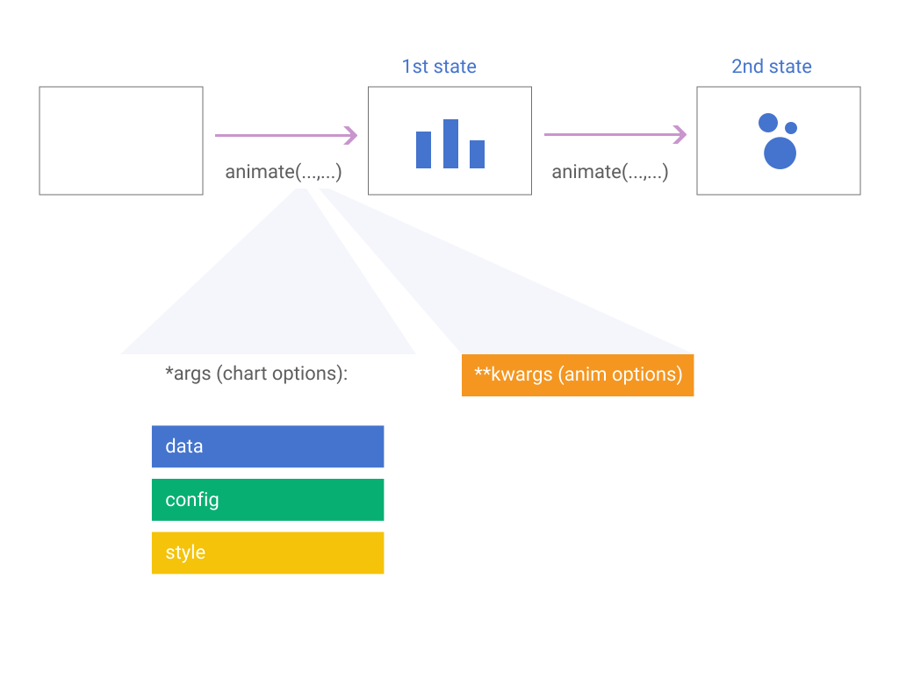

# Tutorial

This is the tutorial of `ipyvizzu` - the `Jupyter Notebook` integration of the
free, open-source JavaScript/C++ library [Vizzu](https://lib.vizzuhq.com/). You
can create animated charts, data stories, and interactive explorers with it.
This is an excellent place to start using `ipyvizzu`, as it walks you through
the installation of the library, introduces the logic it employs and the
different settings to control how your animated charts look and behave.

## Vizzu

`Vizzu` is a free, open-source JavaScript/C++ library utilizing a generic
dataviz engine that generates many types of charts and seamlessly animates
between them. It can be used to create static charts but more importantly it is
designed for building animated data stories and interactive explorers as `Vizzu`
enables showing different perspectives of the data that the viewers can easily
follow due to the animation. Visit
[Vizzu on GitHub](https://github.com/vizzuhq/vizzu-lib).

## The basic logic of Vizzu

The foundation of a `Vizzu` chart used in `ipyvizzu` is the animation. The
animation contains states describing the chart's configuration, such as the data
series, coordinate system, labels, titles, etc. A static chart is the result of
a single animation state. When there are more states, `Vizzu` automatically
transitions between these. The animate method initiates the animation into a new
state by describing the new chart and how `Vizzu` should transition to it. The
return value of the animate method is a promise that will be resolved after the
animation is completed. Using this logic you can create a promise chain of
animation from state to state.



The animate method has non-keyword and keyword arguments. The non-keyword
arguments sets the chart, and the (optional) keyword arguments determines how
`Vizzu` should animate to that state.

There are three types of non-keyword arguments:

- `data`: this is where you add the data that you want to put on the charts
- `config`: this is where you can add or remove series on the channels and set
  the general settings of the chart like the chart title, the geometry, the
  alignment etc.
- `style`: this is where you can set how your chart looks

## ipyvizzu

The following tutorial is an excellent place to start using `ipyvizzu`, as it
walks you through the installation, introduces the logic `ipyvizzu` employs and
the different settings to control how your charts look and behave.

### Installation

```sh
pip install ipyvizzu
```

Visit [Installation chapter](../installation.md) of our documentation site for
more installation options and details.

### Usage

!!! note
    `ipyvizzu` only generates the JavaScript code, the `Vizzu` calls are
    evaluated by the browser. Therefore if a blank space appears where the chart
    should be, check the console of your browser where `Vizzu` reports its
    errors.
